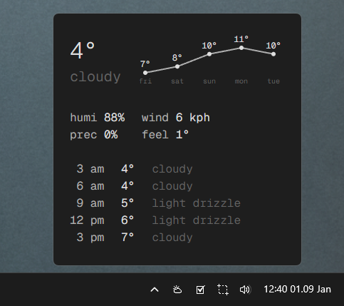

# Windows Tray Weather

A minimalist Windows system tray application that displays weather information with full forecast details.



### Dev

```Development
# Install dependencies
npm install

# Build the renderer
npm run build:renderer

# Run the application
npm start

# Run in development mode (with hot reload)
npm run dev

# Or run renderer and electron separately
npm run dev:renderer  # Terminal 1
npm run dev:electron  # Terminal 2

# Build the application
npm run build
```

## Project Structure

```
windows-tray-weather/
├── src/
│   ├── main/                 # Electron main process
│   │   ├── main.cjs         # App entry point
│   │   ├── tray.cjs         # Tray icon management
│   │   ├── popup-window.cjs # Popup window creation
│   │   └── ipc-handlers.cjs # Settings persistence
│   ├── renderer/             # Renderer process (UI)
│   │   ├── lib/
│   │   │   ├── components/
│   │   │   │   ├── Weather.svelte
│   │   │   │   ├── TemperatureGraph.svelte
│   │   │   │   └── Settings.svelte
│   │   │   ├── weather-api.js
│   │   │   ├── location-api.js
│   │   │   └── settings-store.js
│   │   ├── App.svelte
│   │   └── main.js
│   └── preload/
│       └── preload.js        # IPC bridge
├── out/                      # Built renderer files
├── dist/                     # Distribution files
└── package.json
```

## Credits

Weather functionality adapted from [re-start](https://github.com/math0ne/re-start).

## License

MIT
